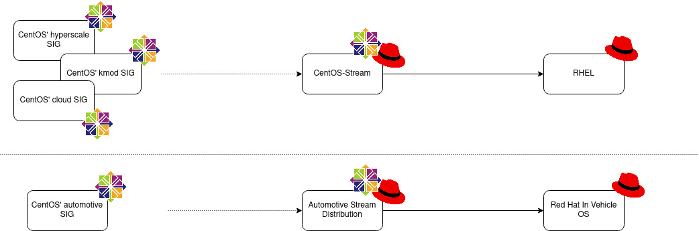

# Welcome to the Automotive SIG

This site contains general information about the Automotive SIG, as well as
how to contribute to the repository and how to build and download images.

For more information about the SIG's charter, members, or goal, see the
[Automotive SIG page on the CentOS wiki](https://wiki.centos.org/SpecialInterestGroup/Automotive).


## Artifacts

The Automotive SIG is working on several artifacts:

* The Automotive Stream Distribution, this project is a binary distribution
  developed within the SIG that serves as a public, in-development preview of
  the upcoming Red Hat In-Vehicle Operating System.
* The Automotive SIG repositories, these are RPM repositories produced by the SIG
  to enhance the Automotive Stream Distribution. New packages or features can be
  developed and hosted there and thus expand the capabilities of the Automotive
  Stream Distribution.
* Sample images, these are images built with [OSBuild](https://www.osbuild.org/)
  using packages from the Automotive Stream Distribution, the Automotive SIG
  repositories or other sources and are meant to be examples of how the Red Hat
  automotive product can be used.


### The Automotive Stream Distribution

The Automotive Stream Distribution (AutoSD) is an upstream to the Red Hat
automotive product, just as CentOS Stream is to RHEL. The Automotive Stream Distribution
will be based on CentOS Stream with a few divergences where it makes sense/is
required. The first of these divergences will be the Linux kernel. AutoSD will
rely on the kernel-automotive package rather than CentOS Stream's kernel package.



As a binary distribution, AutoSD will thus be the place where the community,
customers and/or partners will be able to see what will land in the automotive
product down the line. Like CentOS Stream, Automotive Stream Distribution will
be opened to contributions, using similar mechanisms.

You can learn more about how the content of the Automotive Stream Distribution
is gathered in our page about [Content Definition](https://sigs.centos.org/automotive/content_definition/).

You can browse the latest version of the Automotive Stream Distribution at:
[http://autosd.sig.centos.org](http://autosd.sig.centos.org).

You can also download a local copy of this repository using `wget`:

```
wget --recursive --no-parent -R "index.html*" 'http://autosd.sig.centos.org/AutoSD-9/latest/cs9/'
```

Ensure you have approximately 1.3G of disk space available (total for both
aarch64 and x86_64). This size might change as the package set evolves.


### The Automotive SIG repositories

The Automotive SIG repositories can be browsed at:
[https://buildlogs.centos.org/9-stream/automotive/](https://buildlogs.centos.org/9-stream/automotive/).

They will include packages that are not part of Red Hat's automotive offering but
are of interest to SIG members. These packages may be a work in progress with
the idea that it will land in the Automotive Stream Distribution (and thus Red
Hat's automotive offering) or purely R&D, experimental or integration work that
will remain outside of the Automotive Stream Distribution.

Any and every SIG members can ask for packages to be distributed via these
repositories as long as they meet [CentOS' requirements for SIG](https://wiki.centos.org/SpecialInterestGroup#Requirements)


### Sample images

The [Automotive SIG](https://gitlab.com/redhat/automotive/automotive-sig)
repository contains manifests for different operating systems and platforms.

The manifests are located in the `osbuild-manifests` folder.
```
    osbuild-manifests/
    └── <OS>
        └── <platform>
```

For example:
```
    osbuild-manifests
    └── cs9
        ├── minimal.mpp.yml
        ├── neptune.mpp.yml
        └── ...
```

You can use [OSBuild](https://www.osbuild.org/) to build each of these manifests.
For more information, see [Building images](https://sigs.centos.org/automotive/building/).

You can also find pre-built images from our [Download images
](https://sigs.centos.org/automotive/download_images/) page.


## Contact points

* [CentOS-Automotive-SIG mailing list](https://lists.centos.org/mailman/listinfo/centos-automotive-sig)
* IRC channel: `#centos-automotive` on `irc.libera.chat`. For more information, see [Libera.Chat](https://libera.chat/>).
